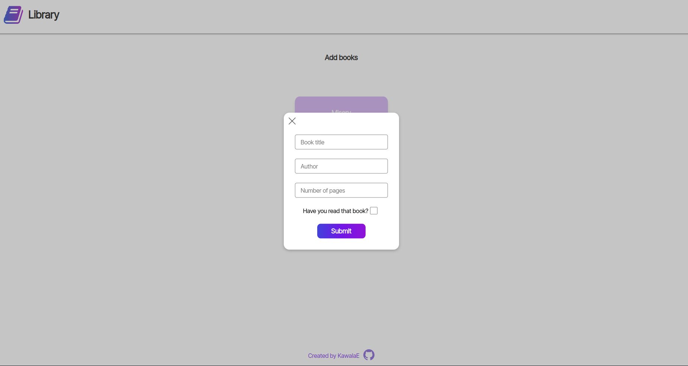

Library application that allows users to add and remove books as well as change their status. Storage options will be added shortly. 

<h2><a ref="https://kawalae.github.io/Library/">Click here to view!</a></h2>
<h2><strong>Technologies used</strong></h2>

</img>
</img>
</img>
</img>

<h2><strong>Project description</strong></h2>
</img>

</img>

<h2><strong>Acknowledgements</strong></h2>
<ul>
    <li>Icon by <a href="https://freeicons.io/profile/823">Muhammad Haq</a> on <a href="https://freeicons.io">freeicons.io</a></li>
    <li><a target="_blank" href="https://icons8.com/icon/RBnCyho7WRn7/eslint">ESLint</a> icon by <a target="_blank" href="https://icons8.com">Icons8</a></li>

</ul>
