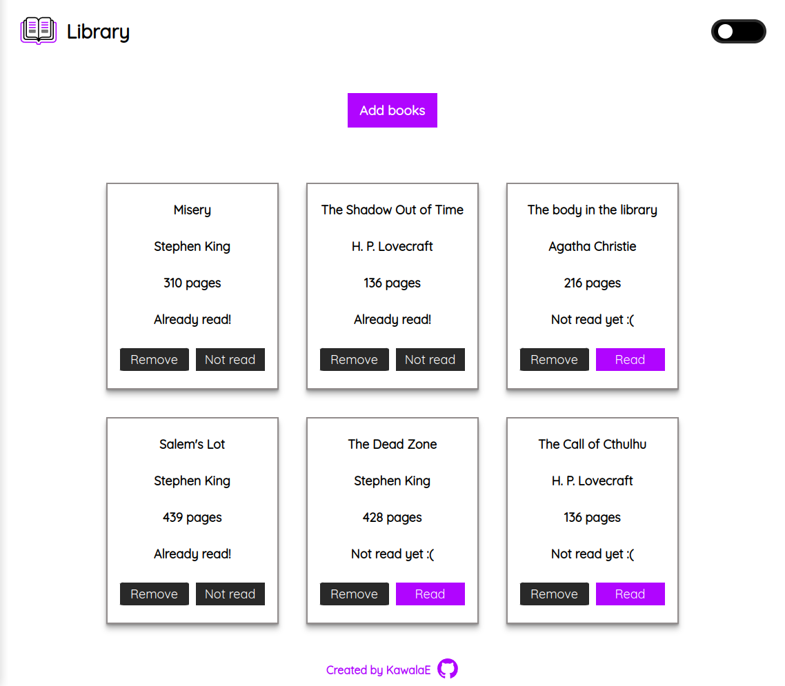
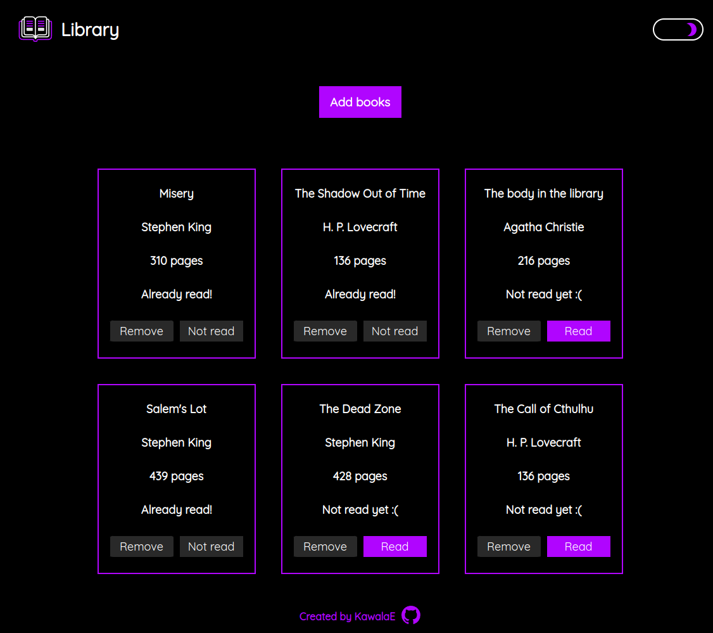
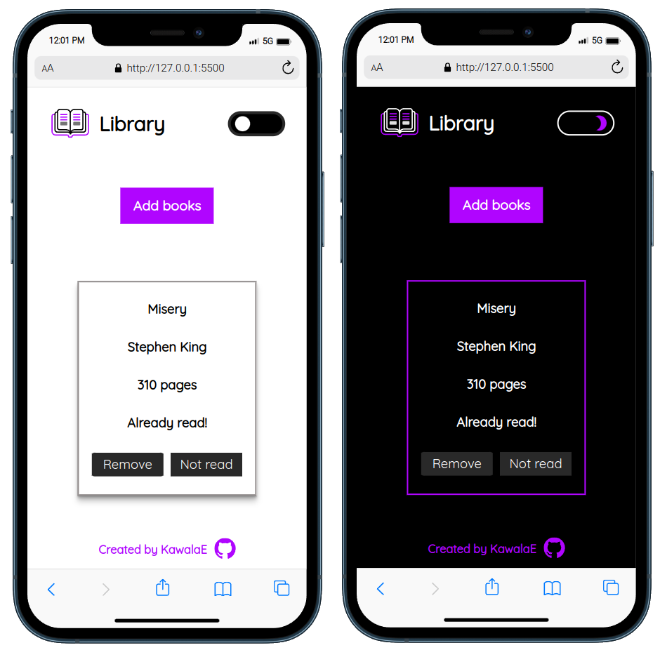

The Book Library Web App is a application built using HTML, CSS, and JavaScript. It leverages popular tools like ESLint and Prettier for code quality and consistency and utilizes the browser's localStorage for data and theme management.

<h2><a href="https://kawalae.github.io/Library/">Click here to view!</a></h2>

<h3>Tech Stack</h3>
<ul>
<li><b>Front-end</b>: JavaScript, HTML, CSS,</li>
<li><b>Code Quality</b>: ESLint,</li>
<li><b>Code Formatting</b>: Prettier,</li>
<li><b>Data Storage</b>: Browser's Local Storage,</li>
</ul>

</img>
</img>
</img>
</img>
</img>

<h2><strong>Project description</strong></h2>
</img>
</img>

</img>

<h2><strong>Acknowledgements</strong></h2>
<ul>
    <li><a href="https://www.svgrepo.com/svg/406740/notebook-with-decorative-cover">Notebook With Decorative Cover</a></li>
    <li>Icon by <a href="https://freeicons.io/profile/823">Muhammad Haq</a> on <a href="https://freeicons.io">freeicons.io</a></li>
    <li><a target="_blank" href="https://icons8.com/icon/21278/css3">CSS</a> icon by <a target="_blank" href="https://icons8.com">Icons8</a></li>
    <li><a target="_blank" href="https://icons8.com/icon/PXTY4q2Sq2lG/javascript">JavaScript</a> icon by <a target="_blank" href="https://icons8.com">Icons8</a></li>
    <li><a target="_blank" href="https://icons8.com/icon/v8RpPQUwv0N8/html-5">Html 5</a> icon by <a target="_blank" href="https://icons8.com">Icons8</a></li>
    <li><a href="https://www.svgrepo.com/svg/477075/hard-disk">Hard disk icon</a></li>
</ul>
